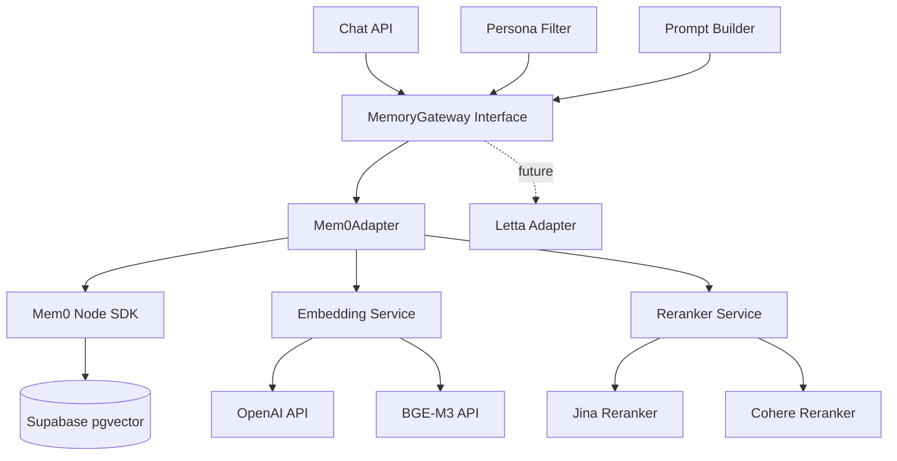

# Design Document: Mem0 Memory System Migration

## Overview

本设计文档定义了从当前自实现RAG记忆系统迁移到Mem0记忆引擎的技术架构。当前系统在处理中文指代词（如"那个展""那只猫"）时存在上下文衔接问题，系统无法自然延续对话，而是生硬地反问用户。本次迁移通过引入以下技术方案解决问题：

1. **MemoryGateway抽象层**：隔离记忆引擎实现，支持未来在Mem0和Letta之间切换
2. **Mem0集成**：使用Mem0 Node SDK作为核心记忆引擎，利用其成熟的向量检索能力
3. **Supabase pgvector**：统一向量存储后端，替代本地JSON文件
4. **中文优化Embedding**：支持OpenAI text-embedding-3-large和BAAI/bge-m3
5. **Reranker集成**：使用Jina或Cohere reranker提升检索结果相关性
6. **数据迁移策略**：安全地将.data/app-store.json迁移到Supabase

### 设计目标

- 提升中文指代词场景的上下文衔接自然度（C类测试通过率达到90%以上）
- 保持现有API接口不变，确保向后兼容性
- 保留persona系统和身份一致性检查机制
- 支持灵活的embedding和reranker配置
- 提供可观测的性能监控能力

## Architecture

### 系统架构图



### 架构层次

1. **接口层（Interface Layer）**
   - `MemoryGateway`：统一的记忆操作接口
   - 定义标准的add/search/update/delete方法
   - 隔离具体实现细节

2. **适配器层（Adapter Layer）**
   - `Mem0Adapter`：Mem0 SDK的封装实现
   - `LettaAdapter`（未来）：Letta的封装实现
   - 处理配置、初始化、错误处理

3. **服务层（Service Layer）**
   - `EmbeddingService`：文本向量化服务
   - `RerankerService`：检索结果重排序服务
   - 支持多提供商配置和降级策略

4. **存储层（Storage Layer）**
   - Supabase pgvector：向量数据库
   - 存储记忆内容、向量、元数据

### 数据流

**记忆保存流程**：
```
User Message → Chat API → saveSessionMemories() 
→ MemoryGateway.add() → Mem0Adapter 
→ EmbeddingService.embed() → Mem0SDK.add() 
→ Supabase pgvector
```

**记忆检索流程**：
```
User Query → Chat API → getMemoryContext() 
→ MemoryGateway.search() → Mem0Adapter 
→ EmbeddingService.embed() → Mem0SDK.search() 
→ Supabase pgvector → RerankerService.rerank() 
→ Persona Filter → Prompt Builder
```

## Components and Interfaces

### 1. MemoryGateway Interface

```typescript
// src/lib/memory/gateway.ts

export interface MemoryGateway {
  /**
   * 添加记忆
   */
  add(params: AddMemoryParams): Promise<MemoryResult>;
  
  /**
   * 搜索记忆
   */
  search(params: SearchMemoryParams): Promise<MemorySearchResult>;
  
  /**
   * 更新记忆
   */
  update(params: UpdateMemoryParams): Promise<MemoryResult>;
  
  /**
   * 删除记忆
   */
  delete(memoryId: string): Promise<void>;
  
  /**
   * 批量保存会话记忆
   */
  saveSessionMemories(params: SaveSessionMemoriesParams): Promise<SaveSessionMemoriesResult>;
  
  /**
   * 获取记忆上下文（用于prompt构建）
   */
  getMemoryContext(params: GetMemoryContextParams): Promise<MemoryContext>;
}

export type AddMemoryParams = {
  userId: string;
  personaId: string;
  memoryType: MemoryType;
  content: string;
  importance?: number;
  sourceSessionId?: string | null;
};

export type SearchMemoryParams = {
  userId: string;
  personaId: string;
  query: string;
  limit?: number;
  memoryTypes?: MemoryType[];
};

export type UpdateMemoryParams = {
  memoryId: string;
  content?: string;
  importance?: number;
  memoryType?: MemoryType;
};

export type MemoryResult = {
  id: string;
  userId: string;
  personaId: string;
  memoryType: MemoryType;
  content: string;
  importance: number;
  sourceSessionId: string | null;
  createdAt: string;
  updatedAt: string;
};

export type MemorySearchResult = {
  memories: MemoryResult[];
  totalCount: number;
};

export type SaveSessionMemoriesParams = {
  userId: string;
  personaId: string;
  sessionId: string;
  topics: string[];
  summary: string;
  memories: Array<{
    memory_type: MemoryType;
    content: string;
    importance?: number;
  }>;
  profile: Partial<UserProfilePerPersonaData> & {
    relationship_stage?: UserProfilePerPersonaRecord["relationship_stage"];
    total_messages?: number;
  };
};

export type SaveSessionMemoriesResult = {
  memories: MemoryResult[];
  profile: UserProfilePerPersonaRecord;
};

export type GetMemoryContextParams = {
  userId: string;
  personaId: string;
  persona: Persona;
  query: string;
  limit?: number;
};

export type MemoryContext = {
  userProfile: UserProfilePerPersonaRecord | null;
  recentSummaries: SessionRecord[];
  relevantMemories: MemoryResult[];
};
```

### 2. Mem0Adapter Implementation

```typescript
// src/lib/memory/adapters/mem0-adapter.ts

import { MemoryClient } from 'mem0ai';
import type { MemoryGateway } from '../gateway';

export class Mem0Adapter implements MemoryGateway {
  private client: MemoryClient;
  private embeddingService: EmbeddingService;
  private rerankerService: RerankerService;
  
  constructor(config: Mem0AdapterConfig) {
    this.client = new MemoryClient({
      apiKey: config.apiKey,
      vectorStore: {
        provider: 'supabase',
        config: {
          url: config.supabaseUrl,
          apiKey: config.supabaseKey,
          collectionName: 'memories',
        },
      },
    });
    
    this.embeddingService = new EmbeddingService(config.embeddingConfig);
    this.rerankerService = new RerankerService(config.rerankerConfig);
  }
  
  async add(params: AddMemoryParams): Promise<MemoryResult> {
    const startTime = Date.now();
    
    try {
      // 生成embedding
      const embedding = await this.embeddingService.embed(params.content);
      
      // 调用Mem0 SDK
      const result = await this.client.add({
        messages: [{ role: 'user', content: params.content }],
        user_id: params.userId,
        metadata: {
          persona_id: params.personaId,
          memory_type: params.memoryType,
          importance: params.importance ?? 0.5,
          source_session_id: params.sourceSessionId,
        },
        embedding,
      });
      
      // 记录性能指标
      this.recordMetric('memory.add.duration', Date.now() - startTime);
      
      return this.mapMem0ResultToMemoryResult(result);
    } catch (error) {
      this.handleError('add', error);
      throw error;
    }
  }
  
  async search(params: SearchMemoryParams): Promise<MemorySearchResult> {
    const startTime = Date.now();
    
    try {
      // 生成query embedding
      const queryEmbedding = await this.embeddingService.embed(params.query);
      
      // 调用Mem0 SDK搜索
      const results = await this.client.search({
        query: params.query,
        user_id: params.userId,
        limit: (params.limit ?? 5) * 2, // 获取2倍数量用于reranking
        filters: {
          persona_id: params.personaId,
          ...(params.memoryTypes && { memory_type: { $in: params.memoryTypes } }),
        },
        embedding: queryEmbedding,
      });
      
      // 应用reranker
      const rerankedResults = await this.rerankerService.rerank({
        query: params.query,
        documents: results.map(r => r.memory),
        topK: params.limit ?? 5,
      });
      
      // 记录性能指标
      this.recordMetric('memory.search.duration', Date.now() - startTime);
      
      return {
        memories: rerankedResults.map(r => this.mapMem0ResultToMemoryResult(r)),
        totalCount: results.length,
      };
    } catch (error) {
      this.handleError('search', error);
      throw error;
    }
  }
  
  async update(params: UpdateMemoryParams): Promise<MemoryResult> {
    // 实现更新逻辑
  }
  
  async delete(memoryId: string): Promise<void> {
    // 实现删除逻辑
  }
  
  async saveSessionMemories(params: SaveSessionMemoriesParams): Promise<SaveSessionMemoriesResult> {
    // 实现批量保存逻辑，保持与现有long-term.ts的兼容性
  }
  
  async getMemoryContext(params: GetMemoryContextParams): Promise<MemoryContext> {
    // 实现记忆上下文获取，保持与现有retriever.ts的兼容性
  }
  
  private mapMem0ResultToMemoryResult(mem0Result: any): MemoryResult {
    // 映射Mem0结果到标准格式
  }
  
  private recordMetric(name: string, value: number): void {
    // 记录性能指标
  }
  
  private handleError(operation: string, error: unknown): void {
    // 错误处理和日志记录
  }
}

export type Mem0AdapterConfig = {
  apiKey: string;
  supabaseUrl: string;
  supabaseKey: string;
  embeddingConfig: EmbeddingServiceConfig;
  rerankerConfig: RerankerServiceConfig;
};
```

### 3. EmbeddingService

```typescript
// src/lib/memory/services/embedding-service.ts

export class EmbeddingService {
  private provider: 'openai' | 'bge-m3';
  private apiKey: string;
  private model: string;
  
  constructor(config: EmbeddingServiceConfig) {
    this.provider = config.provider;
    this.apiKey = config.apiKey;
    this.model = config.model;
  }
  
  async embed(text: string): Promise<number[]> {
    const startTime = Date.now();
    
    try {
      if (this.provider === 'openai') {
        return await this.embedWithOpenAI(text);
      } else if (this.provider === 'bge-m3') {
        return await this.embedWithBGE(text);
      }
      
      throw new Error(`Unsupported embedding provider: ${this.provider}`);
    } catch (error) {
      console.warn(`[EmbeddingService] Error: ${error}. Falling back to hash-based embedding.`);
      return this.generateFallbackEmbedding(text);
    } finally {
      this.recordMetric('embedding.duration', Date.now() - startTime);
    }
  }
  
  private async embedWithOpenAI(text: string): Promise<number[]> {
    const response = await fetch('https://api.openai.com/v1/embeddings', {
      method: 'POST',
      headers: {
        'Content-Type': 'application/json',
        'Authorization': `Bearer ${this.apiKey}`,
      },
      body: JSON.stringify({
        model: this.model, // text-embedding-3-large
        input: text,
      }),
    });
    
    if (!response.ok) {
      throw new Error(`OpenAI API failed: ${response.status}`);
    }
    
    const data = await response.json();
    return data.data[0].embedding;
  }
  
  private async embedWithBGE(text: string): Promise<number[]> {
    // 实现BGE-M3调用逻辑
  }
  
  private generateFallbackEmbedding(text: string): number[] {
    // 保留现有的fallback逻辑
  }
  
  private recordMetric(name: string, value: number): void {
    // 记录性能指标
  }
}

export type EmbeddingServiceConfig = {
  provider: 'openai' | 'bge-m3';
  apiKey: string;
  model: string;
};
```

### 4. RerankerService

```typescript
// src/lib/memory/services/reranker-service.ts

export class RerankerService {
  private provider: 'jina' | 'cohere' | 'none';
  private apiKey: string;
  
  constructor(config: RerankerServiceConfig) {
    this.provider = config.provider;
    this.apiKey = config.apiKey;
  }
  
  async rerank(params: RerankParams): Promise<RerankResult[]> {
    if (this.provider === 'none') {
      return params.documents.slice(0, params.topK);
    }
    
    const startTime = Date.now();
    
    try {
      if (this.provider === 'jina') {
        return await this.rerankWithJina(params);
      } else if (this.provider === 'cohere') {
        return await this.rerankWithCohere(params);
      }
      
      throw new Error(`Unsupported reranker provider: ${this.provider}`);
    } catch (error) {
      console.warn(`[RerankerService] Error: ${error}. Using original order.`);
      return params.documents.slice(0, params.topK);
    } finally {
      this.recordMetric('reranker.duration', Date.now() - startTime);
    }
  }
  
  private async rerankWithJina(params: RerankParams): Promise<RerankResult[]> {
    const response = await fetch('https://api.jina.ai/v1/rerank', {
      method: 'POST',
      headers: {
        'Content-Type': 'application/json',
        'Authorization': `Bearer ${this.apiKey}`,
      },
      body: JSON.stringify({
        model: 'jina-reranker-v2-base-multilingual',
        query: params.query,
        documents: params.documents.map(d => d.content),
        top_n: params.topK,
      }),
    });
    
    if (!response.ok) {
      throw new Error(`Jina API failed: ${response.status}`);
    }
    
    const data = await response.json();
    return data.results.map((r: any) => params.documents[r.index]);
  }
  
  private async rerankWithCohere(params: RerankParams): Promise<RerankResult[]> {
    // 实现Cohere调用逻辑
  }
  
  private recordMetric(name: string, value: number): void {
    // 记录性能指标
  }
}

export type RerankerServiceConfig = {
  provider: 'jina' | 'cohere' | 'none';
  apiKey: string;
};

export type RerankParams = {
  query: string;
  documents: Array<{ content: string; [key: string]: any }>;
  topK: number;
};

export type RerankResult = {
  content: string;
  score?: number;
  [key: string]: any;
};
```

### 5. 配置管理

```typescript
// src/lib/memory/config.ts

export function getMemoryGatewayConfig(): MemoryGatewayConfig {
  return {
    provider: (process.env.MEMORY_PROVIDER as 'mem0' | 'letta') ?? 'mem0',
    mem0: {
      apiKey: process.env.MEM0_API_KEY ?? '',
      supabaseUrl: process.env.SUPABASE_URL ?? '',
      supabaseKey: process.env.SUPABASE_ANON_KEY ?? '',
      embeddingConfig: {
        provider: (process.env.EMBEDDING_PROVIDER as 'openai' | 'bge-m3') ?? 'openai',
        apiKey: process.env.OPENAI_API_KEY ?? process.env.EMBEDDING_API_KEY ?? '',
        model: process.env.EMBEDDING_MODEL ?? 'text-embedding-3-large',
      },
      rerankerConfig: {
        provider: (process.env.RERANKER_PROVIDER as 'jina' | 'cohere' | 'none') ?? 'jina',
        apiKey: process.env.RERANKER_API_KEY ?? '',
      },
    },
  };
}

export type MemoryGatewayConfig = {
  provider: 'mem0' | 'letta';
  mem0: Mem0AdapterConfig;
};
```

### 6. 工厂函数

```typescript
// src/lib/memory/factory.ts

import { Mem0Adapter } from './adapters/mem0-adapter';
import { getMemoryGatewayConfig } from './config';
import type { MemoryGateway } from './gateway';

let gatewayInstance: MemoryGateway | null = null;

export function getMemoryGateway(): MemoryGateway {
  if (gatewayInstance) {
    return gatewayInstance;
  }
  
  const config = getMemoryGatewayConfig();
  
  if (config.provider === 'mem0') {
    gatewayInstance = new Mem0Adapter(config.mem0);
  } else {
    throw new Error(`Unsupported memory provider: ${config.provider}`);
  }
  
  return gatewayInstance;
}
```

## Data Models

### Supabase Schema

```sql
-- memories表（由Mem0管理，但需要确保schema兼容）
CREATE TABLE IF NOT EXISTS memories (
  id UUID PRIMARY KEY DEFAULT gen_random_uuid(),
  user_id TEXT NOT NULL,
  persona_id TEXT NOT NULL,
  memory_type TEXT NOT NULL CHECK (memory_type IN ('user_fact', 'persona_fact', 'shared_event', 'relationship', 'session_summary')),
  content TEXT NOT NULL,
  embedding VECTOR(1536), -- 使用pgvector扩展
  importance FLOAT NOT NULL DEFAULT 0.5,
  source_session_id TEXT,
  created_at TIMESTAMPTZ NOT NULL DEFAULT NOW(),
  updated_at TIMESTAMPTZ NOT NULL DEFAULT NOW(),
  
  -- 索引
  INDEX idx_memories_user_persona (user_id, persona_id),
  INDEX idx_memories_type (memory_type),
  INDEX idx_memories_updated (updated_at DESC)
);

-- 向量相似度搜索索引
CREATE INDEX idx_memories_embedding ON memories USING ivfflat (embedding vector_cosine_ops)
WITH (lists = 100);

-- user_profiles_per_persona表（保持现有结构）
CREATE TABLE IF NOT EXISTS user_profiles_per_persona (
  id UUID PRIMARY KEY DEFAULT gen_random_uuid(),
  user_id TEXT NOT NULL,
  persona_id TEXT NOT NULL,
  profile_data JSONB NOT NULL DEFAULT '{
    "summary": "",
    "facts": [],
    "preferences": [],
    "relationship_notes": [],
    "recent_topics": [],
    "anchors": []
  }'::jsonb,
  relationship_stage TEXT NOT NULL DEFAULT 'new' CHECK (relationship_stage IN ('new', 'warming', 'close')),
  total_messages INTEGER NOT NULL DEFAULT 0,
  updated_at TIMESTAMPTZ NOT NULL DEFAULT NOW(),
  
  UNIQUE (user_id, persona_id)
);
```

### 数据映射

**从LocalAppStore到Supabase**：

```typescript
// 迁移脚本中的映射逻辑
function mapLocalMemoryToSupabase(localMemory: MemoryRecord): SupabaseMemoryInsert {
  return {
    id: localMemory.id,
    user_id: localMemory.user_id,
    persona_id: localMemory.persona_id,
    memory_type: localMemory.memory_type,
    content: localMemory.content,
    embedding: localMemory.embedding, // 需要重新生成
    importance: localMemory.importance,
    source_session_id: localMemory.source_session_id,
    created_at: localMemory.created_at,
    updated_at: localMemory.updated_at,
  };
}
```


## 现有代码改造点

### 1. retriever.ts改造

**当前实现**：
- 直接从本地JSON读取记忆
- 使用自定义的加权算法（similarity * 0.7 + importance * 0.15 + recency + lexical）
- 手动实现lexical boost和continuation cue检测

**改造方案**：
```typescript
// src/lib/memory/retriever.ts (重构后)

import { getMemoryGateway } from './factory';
import { filterConflictingPersonaMemories } from '@/lib/persona/identity';

export async function getMemoryContext(input: MemoryContextInput) {
  const gateway = getMemoryGateway();
  
  // 使用MemoryGateway替代直接读取
  const memoryContext = await gateway.getMemoryContext({
    userId: input.userId,
    personaId: input.personaId,
    persona: input.persona,
    query: input.query,
    limit: input.limit ?? 5,
  });
  
  // 保留persona过滤逻辑
  const alignedMemories = filterConflictingPersonaMemories(
    memoryContext.relevantMemories,
    input.persona
  );
  
  return {
    userProfile: memoryContext.userProfile,
    recentSummaries: memoryContext.recentSummaries,
    relevantMemories: alignedMemories,
  };
}
```

**保留的逻辑**：
- `extractQueryAnchors()`：提取指代锚点
- `CONTINUATION_CUE_REGEX`：延续线索检测
- `filterConflictingPersonaMemories()`：persona身份过滤

**移除的逻辑**：
- 直接的embedding相似度计算（由Mem0处理）
- 手动的recency boost计算（由Mem0处理）
- 本地JSON读取（由MemoryGateway处理）

### 2. long-term.ts改造

**当前实现**：
- 直接操作本地JSON文件
- 手动管理embedding生成
- 手动去重和合并逻辑

**改造方案**：
```typescript
// src/lib/memory/long-term.ts (重构后)

import { getMemoryGateway } from './factory';

export async function saveSessionMemories(input: SaveSessionMemoriesInput) {
  const gateway = getMemoryGateway();
  
  // 委托给MemoryGateway
  return gateway.saveSessionMemories({
    userId: input.userId,
    personaId: input.personaId,
    sessionId: input.sessionId,
    topics: input.topics,
    summary: input.summary,
    memories: input.memories,
    profile: input.profile,
  });
}

export async function createMemory(input: CreateMemoryInput) {
  const gateway = getMemoryGateway();
  
  return gateway.add({
    userId: input.userId,
    personaId: input.personaId,
    memoryType: input.memoryType,
    content: input.content,
    importance: input.importance,
    sourceSessionId: input.sourceSessionId,
  });
}

export async function updateMemory(memoryId: string, updates: UpdateMemoryInput) {
  const gateway = getMemoryGateway();
  
  return gateway.update({
    memoryId,
    ...updates,
  });
}

export async function deleteMemory(memoryId: string) {
  const gateway = getMemoryGateway();
  
  return gateway.delete(memoryId);
}

export async function listMemories(userId: string, personaId?: string) {
  const gateway = getMemoryGateway();
  
  const result = await gateway.search({
    userId,
    personaId: personaId ?? '',
    query: '', // 空查询表示列出所有
    limit: 1000,
  });
  
  return result.memories;
}
```

**保留的逻辑**：
- `mergeUniqueStrings()`：用于profile数据合并
- `createEmptyProfileData()`：初始化profile结构
- UserProfile的更新逻辑

**移除的逻辑**：
- `updateLocalAppStore()`调用
- 手动embedding生成
- 本地JSON操作

### 3. embedding.ts改造

**当前实现**：
- 支持OpenRouter和Hugging Face
- 包含fallback hash-based embedding
- 直接在此文件中实现API调用

**改造方案**：
```typescript
// src/lib/memory/embedding.ts (重构后)

import { getMemoryGateway } from './factory';

/**
 * @deprecated 使用MemoryGateway内部的EmbeddingService
 * 保留此函数仅为向后兼容
 */
export async function embedText(input: string): Promise<number[]> {
  const gateway = getMemoryGateway();
  
  // 委托给内部的EmbeddingService
  return (gateway as any).embeddingService.embed(input);
}

export function cosineSimilarity(left: number[] | null, right: number[] | null) {
  // 保留此工具函数
  if (!left || !right || left.length === 0 || right.length === 0) {
    return 0;
  }

  const length = Math.min(left.length, right.length);
  let dot = 0;
  let leftMagnitude = 0;
  let rightMagnitude = 0;

  for (let index = 0; index < length; index += 1) {
    dot += left[index] * right[index];
    leftMagnitude += left[index] * left[index];
    rightMagnitude += right[index] * right[index];
  }

  if (!leftMagnitude || !rightMagnitude) {
    return 0;
  }

  return dot / (Math.sqrt(leftMagnitude) * Math.sqrt(rightMagnitude));
}
```

**保留的逻辑**：
- `cosineSimilarity()`：用于测试和调试
- Fallback embedding逻辑（移到EmbeddingService内部）

**移除的逻辑**：
- 直接的API调用代码（移到EmbeddingService）
- 配置读取逻辑（移到config.ts）

### 4. prompt-builder.ts改造

**当前实现**：
- 接收记忆上下文并格式化为prompt
- 包含延续线索的提示文本

**改造方案**：
无需改造，保持现有实现。`buildChatSystemPrompt()`函数的输入输出接口保持不变，因为MemoryGateway返回的数据结构与现有一致。

**保留的逻辑**：
- 所有现有逻辑保持不变
- 延续线索的提示文本
- Persona身份提醒
- 记忆格式化

### 5. Chat API改造

**当前实现**：
- 调用`getMemoryContext()`获取记忆
- 调用`saveSessionMemories()`保存记忆

**改造方案**：
无需改造。由于`getMemoryContext()`和`saveSessionMemories()`的接口保持不变，Chat API无需修改。

## 数据迁移策略

### 迁移脚本设计

```typescript
// scripts/migrate-to-mem0.ts

import { readLocalAppStore } from '@/lib/local/app-store';
import { getMemoryGateway } from '@/lib/memory/factory';
import { createClient } from '@supabase/supabase-js';

async function migrateMemories() {
  console.log('Starting memory migration to Mem0...');
  
  // 1. 读取本地数据
  const localStore = await readLocalAppStore();
  console.log(`Found ${localStore.memories.length} memories to migrate`);
  
  // 2. 创建备份
  const backupPath = `.data/backups/app-store-before-mem0-migration-${new Date().toISOString()}.json`;
  await fs.writeFile(backupPath, JSON.stringify(localStore, null, 2));
  console.log(`Backup created at ${backupPath}`);
  
  // 3. 初始化Supabase客户端
  const supabase = createClient(
    process.env.SUPABASE_URL!,
    process.env.SUPABASE_SERVICE_KEY! // 使用service key以绕过RLS
  );
  
  // 4. 迁移memories
  const gateway = getMemoryGateway();
  const migratedMemories: string[] = [];
  const failedMemories: Array<{ id: string; error: string }> = [];
  
  for (const memory of localStore.memories) {
    try {
      await gateway.add({
        userId: memory.user_id,
        personaId: memory.persona_id,
        memoryType: memory.memory_type,
        content: memory.content,
        importance: memory.importance,
        sourceSessionId: memory.source_session_id,
      });
      
      migratedMemories.push(memory.id);
      console.log(`Migrated memory ${memory.id}`);
    } catch (error) {
      failedMemories.push({
        id: memory.id,
        error: error instanceof Error ? error.message : String(error),
      });
      console.error(`Failed to migrate memory ${memory.id}:`, error);
    }
  }
  
  // 5. 迁移user profiles
  for (const profile of localStore.userProfilesPerPersona) {
    try {
      const { error } = await supabase
        .from('user_profiles_per_persona')
        .upsert({
          id: profile.id,
          user_id: profile.user_id,
          persona_id: profile.persona_id,
          profile_data: profile.profile_data,
          relationship_stage: profile.relationship_stage,
          total_messages: profile.total_messages,
          updated_at: profile.updated_at,
        });
      
      if (error) throw error;
      console.log(`Migrated profile ${profile.id}`);
    } catch (error) {
      console.error(`Failed to migrate profile ${profile.id}:`, error);
    }
  }
  
  // 6. 验证迁移结果
  const { count: migratedCount } = await supabase
    .from('memories')
    .select('*', { count: 'exact', head: true });
  
  console.log('\nMigration Summary:');
  console.log(`- Total memories in source: ${localStore.memories.length}`);
  console.log(`- Successfully migrated: ${migratedMemories.length}`);
  console.log(`- Failed: ${failedMemories.length}`);
  console.log(`- Verified in Supabase: ${migratedCount}`);
  
  if (failedMemories.length > 0) {
    console.log('\nFailed memories:');
    failedMemories.forEach(f => console.log(`  - ${f.id}: ${f.error}`));
  }
  
  // 7. 生成迁移报告
  const report = {
    timestamp: new Date().toISOString(),
    source: {
      memories: localStore.memories.length,
      profiles: localStore.userProfilesPerPersona.length,
    },
    migrated: {
      memories: migratedMemories.length,
      profiles: localStore.userProfilesPerPersona.length,
    },
    failed: failedMemories,
    verified: {
      memories: migratedCount,
    },
  };
  
  await fs.writeFile(
    `.data/migration-report-${new Date().toISOString()}.json`,
    JSON.stringify(report, null, 2)
  );
  
  console.log('\nMigration completed!');
}

// 运行迁移
migrateMemories().catch(console.error);
```

### 迁移步骤

1. **准备阶段**
   - 确保Supabase数据库已配置pgvector扩展
   - 确保环境变量已配置（MEM0_API_KEY、SUPABASE_URL等）
   - 运行schema初始化脚本

2. **备份阶段**
   - 自动创建.data/app-store.json的备份
   - 备份文件命名包含时间戳

3. **迁移阶段**
   - 逐条迁移记忆数据
   - 为每条记忆重新生成embedding（使用新的EmbeddingService）
   - 迁移user profile数据

4. **验证阶段**
   - 检查Supabase中的记录数量
   - 验证必填字段完整性
   - 生成迁移报告

5. **回滚机制**
   - 如果迁移失败，可从备份恢复
   - 提供回滚脚本

### 回滚脚本

```typescript
// scripts/rollback-migration.ts

async function rollbackMigration(backupPath: string) {
  console.log(`Rolling back from backup: ${backupPath}`);
  
  // 1. 读取备份
  const backup = JSON.parse(await fs.readFile(backupPath, 'utf8'));
  
  // 2. 恢复到本地
  await writeLocalAppStore(backup);
  
  // 3. 清空Supabase（可选）
  const supabase = createClient(
    process.env.SUPABASE_URL!,
    process.env.SUPABASE_SERVICE_KEY!
  );
  
  await supabase.from('memories').delete().neq('id', '00000000-0000-0000-0000-000000000000');
  
  console.log('Rollback completed!');
}
```

## 延续上下文检索优化

### 指代词检测增强

在Mem0Adapter的`getMemoryContext()`实现中，增强指代词检测和权重调整：

```typescript
async getMemoryContext(params: GetMemoryContextParams): Promise<MemoryContext> {
  // 1. 检测延续线索
  const hasContinuationCue = CONTINUATION_CUE_REGEX.test(params.query);
  const queryAnchors = extractQueryAnchors(params.query);
  
  // 2. 获取profile和recent summaries
  const [profile, recentSummaries] = await Promise.all([
    this.getUserProfile(params.userId, params.personaId),
    this.getRecentSummaries(params.personaId, params.userId),
  ]);
  
  // 3. 构建增强查询
  const enhancedQuery = this.buildEnhancedQuery({
    originalQuery: params.query,
    queryAnchors,
    profileAnchors: profile?.profile_data.anchors ?? [],
    recentTopics: recentSummaries.flatMap(s => s.topics ?? []),
  });
  
  // 4. 执行向量搜索（获取2倍数量用于reranking）
  const searchResults = await this.search({
    userId: params.userId,
    personaId: params.personaId,
    query: enhancedQuery,
    limit: (params.limit ?? 5) * 2,
  });
  
  // 5. 应用reranker（特别关注指代词场景）
  const rerankedResults = await this.rerankerService.rerank({
    query: params.query,
    documents: searchResults.memories,
    topK: params.limit ?? 5,
    metadata: {
      hasContinuationCue,
      queryAnchors,
      profileAnchors: profile?.profile_data.anchors ?? [],
    },
  });
  
  return {
    userProfile: profile,
    recentSummaries,
    relevantMemories: rerankedResults,
  };
}

private buildEnhancedQuery(params: {
  originalQuery: string;
  queryAnchors: string[];
  profileAnchors: string[];
  recentTopics: string[];
}): string {
  // 如果查询包含指代词，将profile anchors和recent topics加入查询
  if (params.queryAnchors.length > 0) {
    const contextTerms = [
      ...params.profileAnchors.slice(0, 3),
      ...params.recentTopics.slice(0, 3),
    ].join(' ');
    
    return `${params.originalQuery} ${contextTerms}`;
  }
  
  return params.originalQuery;
}
```

### Reranker配置优化

针对中文指代词场景，配置Jina Reranker的参数：

```typescript
private async rerankWithJina(params: RerankParams): Promise<RerankResult[]> {
  const response = await fetch('https://api.jina.ai/v1/rerank', {
    method: 'POST',
    headers: {
      'Content-Type': 'application/json',
      'Authorization': `Bearer ${this.apiKey}`,
    },
    body: JSON.stringify({
      model: 'jina-reranker-v2-base-multilingual', // 支持中文
      query: params.query,
      documents: params.documents.map(d => d.content),
      top_n: params.topK,
      // 针对指代词场景的优化参数
      return_documents: true,
      // 如果有continuation cue，提升recent documents的权重
      ...(params.metadata?.hasContinuationCue && {
        boost_recent: true,
      }),
    }),
  });
  
  if (!response.ok) {
    throw new Error(`Jina API failed: ${response.status}`);
  }
  
  const data = await response.json();
  return data.results.map((r: any) => ({
    ...params.documents[r.index],
    rerankScore: r.relevance_score,
  }));
}
```

## 性能监控

### 监控指标

```typescript
// src/lib/memory/metrics.ts

export class MemoryMetrics {
  private metrics: Map<string, number[]> = new Map();
  
  record(name: string, value: number): void {
    if (!this.metrics.has(name)) {
      this.metrics.set(name, []);
    }
    
    const values = this.metrics.get(name)!;
    values.push(value);
    
    // 保留最近1000条记录
    if (values.length > 1000) {
      values.shift();
    }
    
    // 如果超过阈值，记录警告
    if (name === 'memory.search.duration' && value > 2000) {
      console.warn(`[MemoryMetrics] Slow memory search: ${value}ms`);
    }
  }
  
  getStats(name: string): MetricStats | null {
    const values = this.metrics.get(name);
    if (!values || values.length === 0) {
      return null;
    }
    
    const sorted = [...values].sort((a, b) => a - b);
    const sum = values.reduce((a, b) => a + b, 0);
    
    return {
      count: values.length,
      mean: sum / values.length,
      median: sorted[Math.floor(sorted.length / 2)],
      p95: sorted[Math.floor(sorted.length * 0.95)],
      p99: sorted[Math.floor(sorted.length * 0.99)],
      min: sorted[0],
      max: sorted[sorted.length - 1],
    };
  }
  
  getAllStats(): Record<string, MetricStats> {
    const result: Record<string, MetricStats> = {};
    
    for (const [name] of this.metrics) {
      const stats = this.getStats(name);
      if (stats) {
        result[name] = stats;
      }
    }
    
    return result;
  }
}

export type MetricStats = {
  count: number;
  mean: number;
  median: number;
  p95: number;
  p99: number;
  min: number;
  max: number;
};

// 全局单例
export const memoryMetrics = new MemoryMetrics();
```

### 监控API

```typescript
// src/app/api/admin/memory-metrics/route.ts

import { memoryMetrics } from '@/lib/memory/metrics';

export async function GET() {
  const stats = memoryMetrics.getAllStats();
  
  return Response.json({
    timestamp: new Date().toISOString(),
    metrics: stats,
  });
}
```


## Correctness Properties

*A property is a characteristic or behavior that should hold true across all valid executions of a system-essentially, a formal statement about what the system should do. Properties serve as the bridge between human-readable specifications and machine-verifiable correctness guarantees.*

### Property 1: Provider Configuration Switching

*For any* valid memory provider configuration (mem0, letta), the factory function should return an instance of the corresponding adapter class.

**Validates: Requirements 1.2**

### Property 2: Standardized Memory Result Format

*For any* memory search query, the returned results should contain all required fields (id, userId, personaId, memoryType, content, importance, createdAt, updatedAt).

**Validates: Requirements 1.3**

### Property 3: Interface Backward Compatibility

*For any* input to getMemoryContext() or saveSessionMemories(), the output structure from the new implementation should match the structure from the old implementation (same fields, same types).

**Validates: Requirements 1.4, 7.1, 7.2**

### Property 4: Memory Persistence Round Trip

*For any* memory with content and metadata, saving it and then querying by userId and personaId should return a memory with the same content and metadata.

**Validates: Requirements 2.3**

### Property 5: Semantic Search Relevance

*For any* search query, all returned memories should have a cosine similarity score above a minimum threshold (e.g., 0.3) with the query embedding.

**Validates: Requirements 2.4**

### Property 6: Memory Type Constraint

*For any* saved memory, its memoryType field should be one of the five valid types: user_fact, persona_fact, shared_event, relationship, or session_summary.

**Validates: Requirements 2.5, 7.4**

### Property 7: Embedding Service Fallback

*For any* text input, if the embedding API fails, the embedText() function should return a fallback embedding vector (not throw an error) with the correct dimensionality (1536).

**Validates: Requirements 3.5**

### Property 8: Reranker Application

*For any* search query with results, if reranker is enabled, the rerank() function should be called and the final results should be in the reranked order.

**Validates: Requirements 4.1**

### Property 9: Reranker Fallback

*For any* search query, if the reranker API fails, the system should return the original vector search results (not throw an error).

**Validates: Requirements 4.6**

### Property 10: Referential Anchor Boosting

*For any* query containing referential anchors (那个, 那只, 那家), memories that contain matching anchors from the user profile should rank higher than in a query without those anchors.

**Validates: Requirements 5.1**

### Property 11: Continuation Cue Recency Boost

*For any* query containing continuation cues (后来, 结果, 又), the most recent relevant memories should rank higher than older memories with similar semantic similarity.

**Validates: Requirements 5.2**

### Property 12: Reranker for Referential Queries

*For any* query containing referential anchors, the reranker should be invoked with metadata about the anchors and continuation context.

**Validates: Requirements 5.3**

### Property 13: Unique High-Relevance Memory Prioritization

*For any* search result set, if exactly one memory has a relevance score significantly higher than others (e.g., >0.8 while others <0.5), that memory should be ranked first.

**Validates: Requirements 5.4**

### Property 14: Recency and Importance Weighting Preservation

*For any* two memories with the same semantic similarity, the one with higher importance or more recent timestamp should rank higher.

**Validates: Requirements 5.5**

### Property 15: Migration Data Integrity

*For any* memory in the source data (.data/app-store.json), after migration, a memory with the same content should exist in Supabase with the same metadata (memoryType, importance, sourceSessionId, timestamps).

**Validates: Requirements 6.2**

### Property 16: Migration Embedding Regeneration

*For any* memory migrated from local storage, the memory in Supabase should have a non-null embedding vector with dimensionality 1536.

**Validates: Requirements 6.3**

### Property 17: Migration Completeness Verification

*For any* migration operation, the count of memories in Supabase after migration should equal the count of memories in the source data.

**Validates: Requirements 6.4**

### Property 18: Migration Rollback Round Trip

*For any* backup file, rolling back from that backup should restore the local app store to the exact state captured in the backup.

**Validates: Requirements 6.5**

### Property 19: UserProfile Structure Compatibility

*For any* UserProfile returned by the system, it should contain all required fields: summary, facts, preferences, relationship_notes, recent_topics, and anchors.

**Validates: Requirements 7.3**

### Property 20: C-Category Test No反问 Constraint

*For any* C-category test case input, the system response should not contain the pattern "哪个" followed by a noun (indicating a clarifying question).

**Validates: Requirements 8.3**

### Property 21: C-Category Test Pass Rate

*For any* complete run of C-category test cases, the pass rate should be >= 90%.

**Validates: Requirements 8.5**

### Property 22: Retrieval Limit Configuration

*For any* configured MEMORY_RETRIEVAL_LIMIT value, the number of memories returned by search() should not exceed that limit.

**Validates: Requirements 9.4**

### Property 23: Persona Conflict Filtering

*For any* set of memories containing content that conflicts with a persona's canonical identity, after applying filterConflictingPersonaMemories(), the returned set should not contain memories with conflicting content.

**Validates: Requirements 11.1, 11.2, 11.3**

### Property 24: Canonical Identity in Prompt

*For any* persona, the prompt generated by buildChatSystemPrompt() should contain the canonical identity lines generated by buildCanonicalIdentityLines().

**Validates: Requirements 11.4**

### Property 25: Relationship Stage Constraint

*For any* UserProfile, its relationship_stage field should be one of the three valid values: new, warming, or close.

**Validates: Requirements 11.5**

### Property 26: Performance Metrics Recording

*For any* memory search operation, embedding API call, or reranker API call, a performance metric should be recorded with the operation name and duration.

**Validates: Requirements 12.1, 12.2, 12.3**

### Property 27: Performance Statistics Interface

*For any* metric name that has been recorded, calling getStats(name) should return an object containing count, mean, median, p95, p99, min, and max fields.

**Validates: Requirements 12.5**

