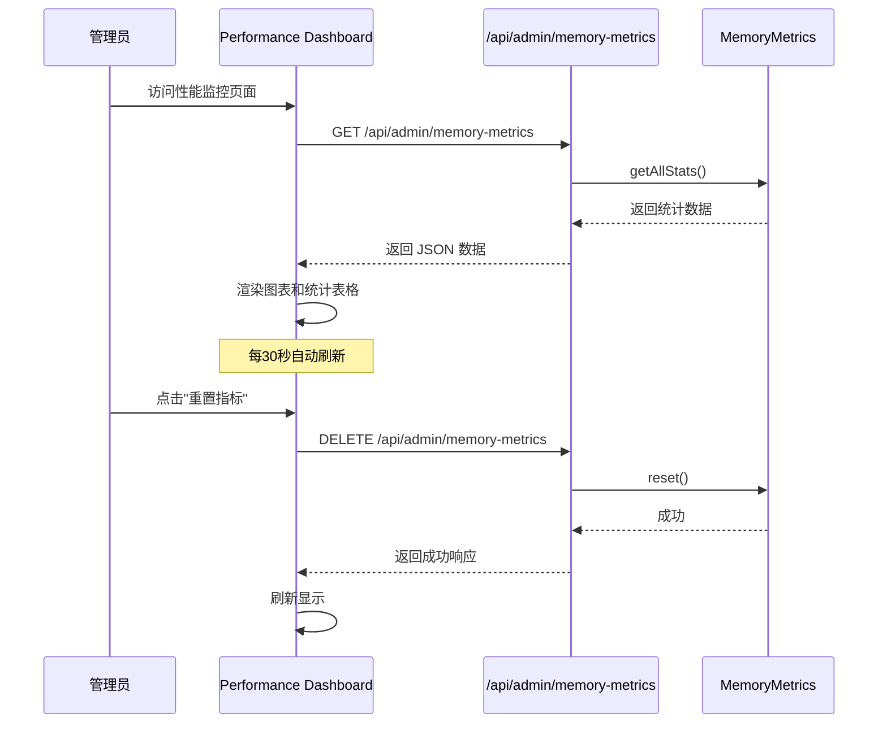
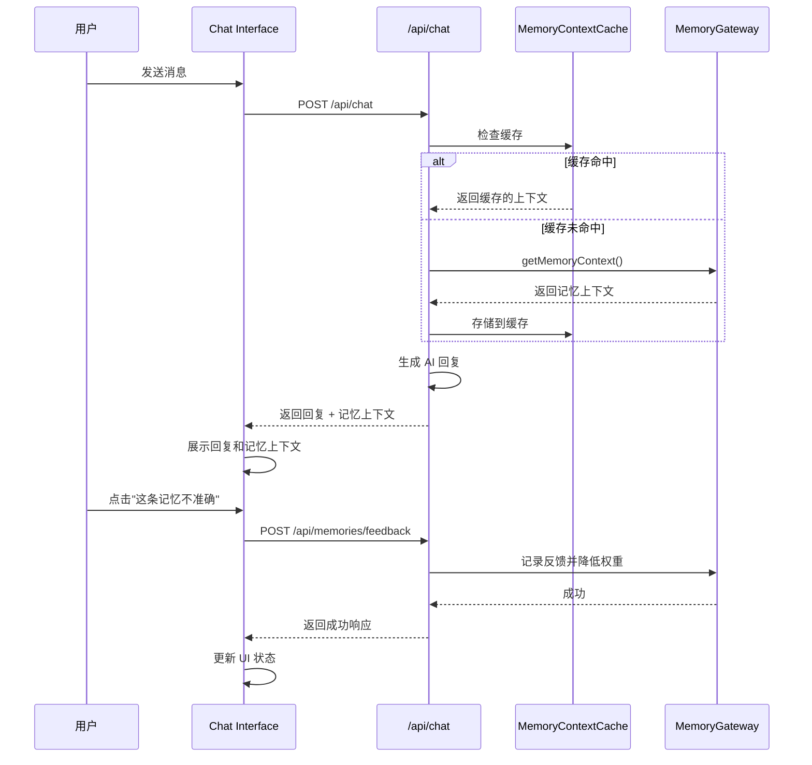
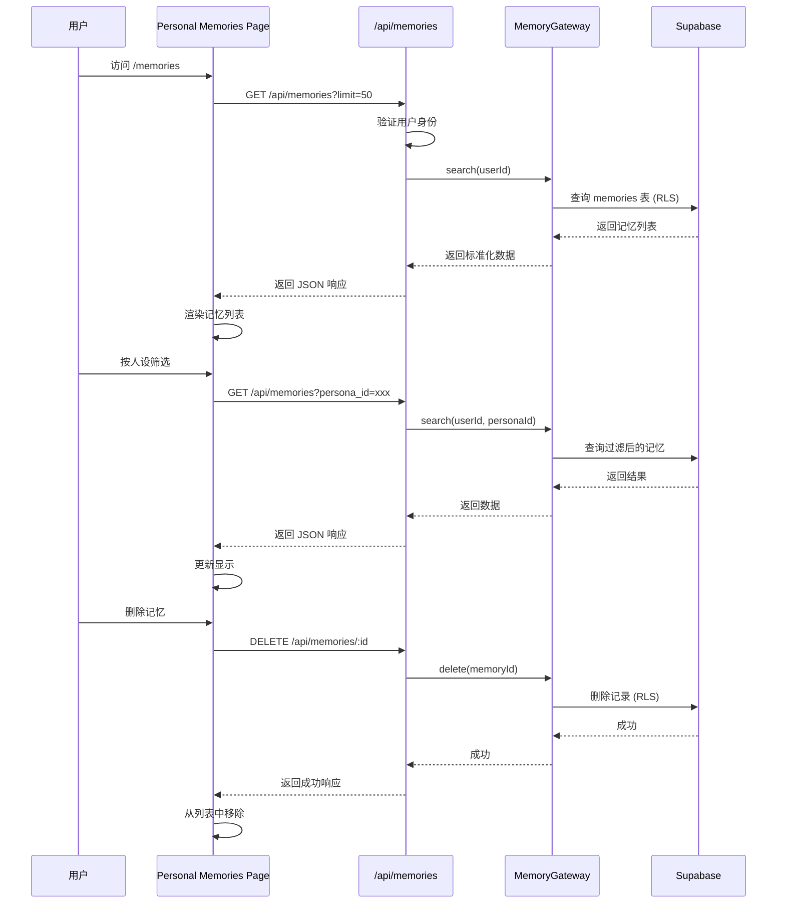

# Design Document: Memory System Frontend Integration

## Overview

本设计文档描述了 AI Companion 前端界面集成 Mem0 记忆系统的技术实现方案。后端已完成 Mem0 记忆系统迁移，包括 MemoryGateway 抽象层、Mem0Adapter、EmbeddingService、RerankerService 和性能监控系统。本次设计聚焦于前端界面增强和用户体验优化。

### 设计目标

1. **管理后台增强**：为管理员提供记忆性能监控、详细技术信息展示和系统配置管理能力
2. **用户界面增强**：在聊天界面中展示记忆上下文，提供个人记忆查看和反馈机制
3. **API 补充**：实现用户端记忆查看、记忆反馈和实时监控接口
4. **数据安全**：确保用户只能访问自己的记忆数据，实现完整的访问控制
5. **性能优化**：通过缓存机制减少重复的 embedding 和检索操作

### 技术栈

- **前端框架**：Next.js 14 (App Router)、React 18、TypeScript
- **UI 组件**：Tailwind CSS、自定义组件库
- **数据可视化**：Recharts（用于性能监控图表）
- **状态管理**：React Hooks (useState, useEffect)
- **API 通信**：Fetch API、Server Actions
- **数据库**：Supabase (PostgreSQL + RLS)
- **缓存**：内存缓存（Map-based）

## Architecture

### 系统架构图

```mermaid
graph TB
    subgraph "Frontend Layer"
        A1[Admin Console]
        A2[User Interface]
        A3[Chat Interface]
    end
    
    subgraph "API Layer"
        B1[/api/admin/memory-performance]
        B2[/api/admin/memory-config]
        B3[/api/admin/memories/search]
        B4[/api/memories]
        B5[/api/memories/feedback]
        B6[/api/chat - enhanced]
    end
    
    subgraph "Service Layer"
        C1[MemoryGateway]
        C2[MemoryMetrics]
        C3[MemoryContextCache]
        C4[ConfigService]
    end
    
    subgraph "Data Layer"
        D1[(Supabase - memories)]
        D2[(Supabase - memory_feedback)]
        D3[(Supabase - user_profiles)]
    end
    
    A1 --> B1
    A1 --> B2
    A1 --> B3
    A2 --> B4
    A2 --> B5
    A3 --> B6
    
    B1 --> C2
    B2 --> C4
    B3 --> C1
    B4 --> C1
    B5 --> C1
    B6 --> C1
    B6 --> C3
    
    C1 --> D1
    C1 --> D2
    C1 --> D3
```

### 数据流设计

#### 1. 记忆性能监控流程



#### 2. 聊天界面记忆上下文展示流程



#### 3. 个人记忆查看流程



## Components and Interfaces

### 前端组件

#### 1. Admin Console 组件

##### MemoryPerformancePage (`/admin/memory-performance/page.tsx`)

管理后台的性能监控页面。

```typescript
type PerformanceMetrics = {
  [metricName: string]: {
    count: number;
    mean: number;
    median: number;
    p95: number;
    p99: number;
    min: number;
    max: number;
  };
};

type MemoryPerformancePageProps = {};

export default function MemoryPerformancePage(): Promise<JSX.Element>;
```

**职责**：
- 从 `/api/admin/memory-metrics` 获取性能数据
- 使用 Recharts 渲染性能趋势图表
- 展示统计表格（count、mean、median、p95、p99、min、max）
- 高亮显示慢查询（>2000ms）
- 提供"重置指标"按钮
- 每 30 秒自动刷新数据

##### MemoryConfigPage (`/admin/memory-config/page.tsx`)

管理后台的系统配置页面。

```typescript
type MemoryConfig = {
  MEMORY_PROVIDER: 'mem0' | 'letta';
  EMBEDDING_PROVIDER: 'openai' | 'bge-m3';
  EMBEDDING_MODEL: string;
  RERANKER_PROVIDER: 'jina' | 'cohere' | 'none';
};

type ConfigHistory = {
  id: string;
  config: MemoryConfig;
  changed_by: string;
  changed_at: string;
};

export default function MemoryConfigPage(): Promise<JSX.Element>;
```

**职责**：
- 展示当前配置
- 提供表单修改配置
- 验证配置有效性（API key 测试）
- 提供"测试连接"功能
- 展示配置修改历史（最近 10 条）
- 提示重启应用以生效

##### AdminMemoriesPage 增强 (`/admin/memories/page.tsx`)

现有的管理后台记忆管理页面，需要增强展示。

```typescript
type EnhancedMemoryDisplay = {
  id: string;
  content: string;
  memory_type: MemoryType;
  embedding_provider: string;
  embedding_model: string;
  embedding_dimension: number;
  created_at: string;
  source_session_id: string | null;
  retrieval_count: number;
  feedback_count_accurate: number;
  feedback_count_inaccurate: number;
};

type MemorySearchTestParams = {
  user_id: string;
  persona_id: string;
  query: string;
  limit?: number;
};

type MemorySearchTestResult = {
  memory: EnhancedMemoryDisplay;
  similarity_score: number;
  reranker_score?: number;
  final_rank: number;
};
```

**职责**：
- 展示记忆的技术详情（embedding provider、model、dimension）
- 提供"查看向量"功能（展示前 10 个维度）
- 在搜索结果中展示相似度分数和 reranker 分数
- 提供"测试检索"功能
- 展示记忆的反馈统计
- 高亮显示需要人工审核的记忆（>3 次不准确反馈）

#### 2. User Interface 组件

##### PersonalMemoriesPage (`/memories/page.tsx`)

用户端的个人记忆查看页面。

```typescript
type PersonalMemory = {
  id: string;
  content: string;
  memory_type: MemoryType;
  persona_name: string;
  persona_id: string;
  created_at: string;
  source_session_id: string | null;
};

type PersonalMemoriesPageProps = {};

export default function PersonalMemoriesPage(): Promise<JSX.Element>;
```

**职责**：
- 展示当前用户的所有记忆
- 支持按人设筛选
- 支持按记忆类型筛选
- 提供搜索功能
- 提供"删除记忆"按钮
- 分页加载（limit=50）
- 显示骨架屏加载状态

##### MemoryContextPanel (`/components/MemoryContextPanel.tsx`)

聊天界面中的记忆上下文展示组件。

```typescript
type MemoryContextItem = {
  id: string;
  content: string;
  memory_type: MemoryType;
  similarity_score: number;
};

type MemoryContextPanelProps = {
  memories: MemoryContextItem[];
  userProfile: string | null;
  isLoading: boolean;
  onFeedback: (memoryId: string, isAccurate: boolean) => void;
};

export function MemoryContextPanel(props: MemoryContextPanelProps): JSX.Element;
```

**职责**：
- 折叠面板展示（默认折叠）
- 展示相关记忆（最多 3 条）
- 展示用户画像摘要
- 显示相似度分数
- 提供"这条记忆不准确"按钮
- 显示加载状态

##### ChatWithPersona 增强 (`/chat/[personaId]/ChatWithPersona.tsx`)

现有的聊天界面组件，需要集成 MemoryContextPanel。

```typescript
type ChatMessage = {
  id: string;
  role: 'user' | 'assistant';
  content: string;
  createdAt: number;
  persisted: boolean;
  memoryContext?: {
    memories: MemoryContextItem[];
    userProfile: string | null;
  };
};
```

**职责**：
- 在消息发送后展示记忆上下文
- 集成 MemoryContextPanel 组件
- 处理记忆反馈提交
- 显示记忆加载状态

#### 3. 导航组件更新

##### AdminLayout 更新 (`/admin/layout.tsx`)

```typescript
const NAV_ITEMS = [
  { href: "/admin/dashboard", label: "仪表盘" },
  { href: "/admin/personas", label: "人设" },
  { href: "/admin/conversations", label: "对话记录" },
  {
    label: "记忆",
    children: [
      { href: "/admin/memories", label: "记忆管理" },
      { href: "/admin/memory-performance", label: "性能监控" },
      { href: "/admin/memory-config", label: "系统配置" },
    ],
  },
  { href: "/admin/prompts", label: "Prompt 版本" },
  { href: "/admin/testing", label: "测试评估" },
];
```

##### 用户侧边栏更新

在 ChatWithPersona 组件的侧边栏中添加"我的记忆"菜单项。

### API 端点

#### 1. 管理员 API

##### GET `/api/admin/memory-metrics`

获取记忆系统性能指标。

**请求**：无参数

**响应**：
```typescript
{
  success: boolean;
  data: {
    [metricName: string]: {
      count: number;
      mean: number;
      median: number;
      p95: number;
      p99: number;
      min: number;
      max: number;
    };
  } | null;
  error: { message: string } | null;
}
```

##### DELETE `/api/admin/memory-metrics`

重置所有性能指标。

**请求**：无参数

**响应**：
```typescript
{
  success: boolean;
  error: { message: string } | null;
}
```

##### GET `/api/admin/memory-config`

获取当前记忆系统配置。

**请求**：无参数

**响应**：
```typescript
{
  success: boolean;
  data: {
    current: MemoryConfig;
    history: ConfigHistory[];
  } | null;
  error: { message: string } | null;
}
```

##### POST `/api/admin/memory-config`

更新记忆系统配置。

**请求**：
```typescript
{
  config: Partial<MemoryConfig>;
}
```

**响应**：
```typescript
{
  success: boolean;
  data: {
    config: MemoryConfig;
    requiresRestart: boolean;
  } | null;
  error: { message: string } | null;
}
```

##### POST `/api/admin/memory-config/test`

测试配置连接。

**请求**：
```typescript
{
  provider: 'embedding' | 'reranker';
  config: Partial<MemoryConfig>;
}
```

**响应**：
```typescript
{
  success: boolean;
  data: {
    isValid: boolean;
    message: string;
  } | null;
  error: { message: string } | null;
}
```

##### POST `/api/admin/memories/search`

测试记忆检索功能。

**请求**：
```typescript
{
  user_id: string;
  persona_id: string;
  query: string;
  limit?: number;
}
```

**响应**：
```typescript
{
  success: boolean;
  data: {
    memories: Array<{
      memory: EnhancedMemoryDisplay;
      similarity_score: number;
      reranker_score?: number;
      final_rank: number;
    }>;
    embedding_time: number;
    search_time: number;
    rerank_time?: number;
    total_time: number;
  } | null;
  error: { message: string } | null;
}
```

##### GET `/api/admin/memory-logs`

获取记忆操作日志。

**请求**：
```typescript
?limit=100&offset=0&operation=memory.add
```

**响应**：
```typescript
{
  success: boolean;
  data: {
    logs: Array<{
      timestamp: string;
      operation: string;
      user_id: string;
      persona_id?: string;
      memory_id?: string;
      duration: number;
      success: boolean;
      error_message?: string;
    }>;
    total_count: number;
  } | null;
  error: { message: string } | null;
}
```

#### 2. 用户端 API

##### GET `/api/memories`

获取当前用户的记忆列表。

**请求**：
```typescript
?persona_id=xxx&memory_type=user_fact&limit=50&offset=0
```

**响应**：
```typescript
{
  success: boolean;
  data: {
    memories: PersonalMemory[];
    total_count: number;
    has_more: boolean;
  } | null;
  error: { message: string } | null;
}
```

##### DELETE `/api/memories/:id`

删除指定记忆。

**请求**：无参数

**响应**：
```typescript
{
  success: boolean;
  error: { message: string } | null;
}
```

##### POST `/api/memories/feedback`

提交记忆反馈。

**请求**：
```typescript
{
  memory_id: string;
  feedback_type: 'accurate' | 'inaccurate';
  feedback_reason?: string;
}
```

**响应**：
```typescript
{
  success: boolean;
  error: { message: string } | null;
}
```

##### POST `/api/chat` (增强)

现有的聊天 API，需要在响应中包含记忆上下文。

**响应增强**：
```typescript
{
  success: boolean;
  data: {
    reply: string;
    session_id: string;
    assistant_message: MessageRecord;
    memory_context: {
      memories: MemoryContextItem[];
      user_profile: string | null;
    };
  } | null;
  error: { message: string } | null;
}
```

### 服务层

#### MemoryContextCache

记忆上下文缓存服务。

```typescript
type CacheKey = string; // `${sessionId}:${messageCount}`
type CacheValue = {
  memoryContext: MemoryContext;
  timestamp: number;
};

class MemoryContextCache {
  private cache: Map<CacheKey, CacheValue>;
  private ttl: number; // 30 minutes
  
  get(sessionId: string, messageCount: number): MemoryContext | null;
  set(sessionId: string, messageCount: number, context: MemoryContext): void;
  invalidate(userId: string, personaId: string): void;
  clear(): void;
}

export const memoryContextCache = new MemoryContextCache();
```

**职责**：
- 缓存记忆上下文数据
- 使用 session_id + message_count 作为缓存键
- 30 分钟 TTL
- 记忆修改时清除相关缓存
- 环境变量 `MEMORY_CONTEXT_CACHE_ENABLED` 控制开关

#### ConfigService

配置管理服务。

```typescript
class ConfigService {
  getCurrentConfig(): MemoryConfig;
  updateConfig(config: Partial<MemoryConfig>): Promise<void>;
  getConfigHistory(limit: number): Promise<ConfigHistory[]>;
  testConnection(provider: 'embedding' | 'reranker', config: Partial<MemoryConfig>): Promise<boolean>;
}

export const configService = new ConfigService();
```

**职责**：
- 读取和更新环境变量配置
- 记录配置修改历史
- 测试 API 连接有效性
- 验证配置参数

#### MemoryLogger

记忆操作日志服务。

```typescript
type MemoryLogEntry = {
  timestamp: string;
  operation: 'memory.add' | 'memory.search' | 'memory.update' | 'memory.delete' | 'memory.feedback';
  user_id: string;
  persona_id?: string;
  memory_id?: string;
  duration: number;
  success: boolean;
  error_message?: string;
};

class MemoryLogger {
  log(entry: MemoryLogEntry): void;
  query(params: { limit?: number; offset?: number; operation?: string }): Promise<MemoryLogEntry[]>;
}

export const memoryLogger = new MemoryLogger();
```

**职责**：
- 记录所有记忆操作日志
- 输出 JSON 格式到 stdout
- 提供日志查询接口
- 支持按操作类型过滤

## Data Models

### 数据库 Schema 更新

#### 新增表：memory_feedback

```sql
CREATE TABLE memory_feedback (
  id UUID PRIMARY KEY DEFAULT gen_random_uuid(),
  user_id TEXT NOT NULL,
  memory_id UUID NOT NULL REFERENCES memories(id) ON DELETE CASCADE,
  feedback_type TEXT NOT NULL CHECK (feedback_type IN ('accurate', 'inaccurate')),
  feedback_reason TEXT,
  created_at TIMESTAMPTZ NOT NULL DEFAULT NOW()
);

CREATE INDEX idx_memory_feedback_memory_id ON memory_feedback(memory_id);
CREATE INDEX idx_memory_feedback_user_id ON memory_feedback(user_id);
CREATE INDEX idx_memory_feedback_created_at ON memory_feedback(created_at DESC);
```

#### memories 表字段新增

```sql
ALTER TABLE memories
ADD COLUMN feedback_count_accurate INTEGER NOT NULL DEFAULT 0,
ADD COLUMN feedback_count_inaccurate INTEGER NOT NULL DEFAULT 0,
ADD COLUMN retrieval_count INTEGER NOT NULL DEFAULT 0;

CREATE INDEX idx_memories_feedback_inaccurate ON memories(feedback_count_inaccurate DESC);
```

#### 新增表：memory_config_history

```sql
CREATE TABLE memory_config_history (
  id UUID PRIMARY KEY DEFAULT gen_random_uuid(),
  config JSONB NOT NULL,
  changed_by TEXT NOT NULL,
  changed_at TIMESTAMPTZ NOT NULL DEFAULT NOW()
);

CREATE INDEX idx_memory_config_history_changed_at ON memory_config_history(changed_at DESC);
```

#### 新增表：memory_operation_logs

```sql
CREATE TABLE memory_operation_logs (
  id UUID PRIMARY KEY DEFAULT gen_random_uuid(),
  timestamp TIMESTAMPTZ NOT NULL DEFAULT NOW(),
  operation TEXT NOT NULL,
  user_id TEXT NOT NULL,
  persona_id TEXT,
  memory_id UUID,
  duration INTEGER NOT NULL, -- milliseconds
  success BOOLEAN NOT NULL,
  error_message TEXT,
  metadata JSONB
);

CREATE INDEX idx_memory_operation_logs_timestamp ON memory_operation_logs(timestamp DESC);
CREATE INDEX idx_memory_operation_logs_operation ON memory_operation_logs(operation);
CREATE INDEX idx_memory_operation_logs_user_id ON memory_operation_logs(user_id);
```

### Supabase RLS 策略

#### memories 表 RLS

```sql
-- 用户只能读取自己的记忆
CREATE POLICY "Users can read own memories"
ON memories FOR SELECT
USING (user_id = auth.uid());

-- 用户只能删除自己的记忆
CREATE POLICY "Users can delete own memories"
ON memories FOR DELETE
USING (user_id = auth.uid());

-- 管理员可以访问所有记忆（通过 service_key 绕过 RLS）
```

#### memory_feedback 表 RLS

```sql
-- 用户只能创建自己的反馈
CREATE POLICY "Users can create own feedback"
ON memory_feedback FOR INSERT
WITH CHECK (user_id = auth.uid());

-- 用户只能读取自己的反馈
CREATE POLICY "Users can read own feedback"
ON memory_feedback FOR SELECT
USING (user_id = auth.uid());
```

### TypeScript 类型定义

#### MemoryFeedback

```typescript
export type MemoryFeedback = {
  id: string;
  user_id: string;
  memory_id: string;
  feedback_type: 'accurate' | 'inaccurate';
  feedback_reason: string | null;
  created_at: string;
};
```

#### MemoryConfigHistory

```typescript
export type MemoryConfigHistory = {
  id: string;
  config: MemoryConfig;
  changed_by: string;
  changed_at: string;
};
```

#### MemoryOperationLog

```typescript
export type MemoryOperationLog = {
  id: string;
  timestamp: string;
  operation: 'memory.add' | 'memory.search' | 'memory.update' | 'memory.delete' | 'memory.feedback';
  user_id: string;
  persona_id: string | null;
  memory_id: string | null;
  duration: number;
  success: boolean;
  error_message: string | null;
  metadata: Record<string, unknown> | null;
};
```

#### EnhancedMemoryResult

```typescript
export type EnhancedMemoryResult = MemoryResult & {
  embedding_provider: string;
  embedding_model: string;
  embedding_dimension: number;
  retrieval_count: number;
  feedback_count_accurate: number;
  feedback_count_inaccurate: number;
};
```


## Correctness Properties

*A property is a characteristic or behavior that should hold true across all valid executions of a system-essentially, a formal statement about what the system should do. Properties serve as the bridge between human-readable specifications and machine-verifiable correctness guarantees.*

### Property Reflection

在分析验收标准后，我识别出以下可以合并的冗余属性：

1. **字段完整性属性合并**：多个"展示所有必需字段"的属性可以合并为单个属性
   - 1.3 (性能指标统计字段)、2.1 (记忆详情字段)、4.4 (记忆上下文字段)、5.5 (个人记忆字段) 可以合并为"数据展示完整性"属性
   
2. **API 响应格式属性合并**：多个"返回所有必需字段"的属性可以合并
   - 7.5 (GET /api/memories 响应)、9.5 (搜索 API 响应)、9.6 (搜索结果字段) 可以合并为"API 响应完整性"属性

3. **反馈记录属性合并**：多个反馈相关的属性可以合并
   - 6.1 (创建反馈记录)、6.2 (反馈字段完整性)、8.6 (存储反馈) 可以合并为"反馈记录完整性"属性

4. **权重降低属性合并**：多个权重降低的属性是重复的
   - 4.6 (记忆反馈降低权重)、6.3 (不准确反馈降低权重)、8.7 (API 更新权重) 描述同一行为，合并为单个属性

5. **身份认证属性合并**：多个认证验证的属性可以合并
   - 7.2 (用户端 API 认证)、8.2 (反馈 API 认证)、9.2 (管理员 API 认证) 可以合并为"API 身份认证"属性

6. **数据隔离属性合并**：多个数据访问控制的属性可以合并
   - 7.6 (用户只能访问自己的记忆)、8.4 (验证 memory_id 属于当前用户)、14.1 (验证 user_id 匹配) 可以合并为"数据访问隔离"属性

经过反思，我将 60+ 个验收标准精简为 20 个独立的、非冗余的正确性属性。


### Property 1: 性能指标统计完整性

*For any* 性能指标数据，当系统展示该指标时，响应必须包含所有必需的统计字段：count、mean、median、p95、p99、min、max。

**Validates: Requirements 1.3**

### Property 2: 慢查询高亮显示

*For any* 性能指标，如果其值超过 2000ms，则在 Performance Dashboard 中该指标必须被高亮显示为慢查询。

**Validates: Requirements 1.6**

### Property 3: 记忆详情字段完整性

*For any* 记忆条目，当在管理后台展示时，必须包含以下字段：embedding_provider、embedding_model、embedding_dimension、created_at、source_session_id、retrieval_count、feedback_count_accurate、feedback_count_inaccurate。

**Validates: Requirements 2.1**

### Property 4: 搜索结果分数完整性

*For any* 记忆搜索结果，每条结果必须包含 similarity_score、reranker_score（如果启用）和 final_rank。

**Validates: Requirements 2.3**

### Property 5: 配置验证有效性

*For any* 配置修改请求，系统必须验证配置的有效性（如 API key 是否可用），只有验证通过的配置才能被保存。

**Validates: Requirements 3.4**

### Property 6: 记忆上下文字段完整性

*For any* 展示的记忆上下文条目，必须包含：content、memory_type、similarity_score。

**Validates: Requirements 4.4**


### Property 7: 反馈降低记忆权重

*For any* 记忆，当用户提交"不准确"反馈时，系统必须将该记忆的 importance 权重乘以 0.5，并在后续检索中使用降低后的权重。

**Validates: Requirements 4.6, 6.3, 8.7**

### Property 8: 个人记忆字段完整性

*For any* 个人记忆条目，在用户端展示时必须包含：content、memory_type、persona_name、persona_id、created_at、source_session_id。

**Validates: Requirements 5.5**

### Property 9: 反馈记录完整性

*For any* 记忆反馈提交，系统必须创建包含以下字段的 memory_feedback 记录：user_id、memory_id、feedback_type、feedback_reason、created_at。

**Validates: Requirements 6.1, 6.2, 8.6**

### Property 10: 高反馈记忆高亮显示

*For any* 记忆，如果其 feedback_count_inaccurate >= 3，则在管理后台必须被高亮显示为需要人工审核。

**Validates: Requirements 6.6**

### Property 11: API 身份认证

*For any* 用户端 API 请求（/api/memories、/api/memories/feedback），系统必须验证请求包含有效的用户 session，未认证的请求必须返回 401 错误。

**Validates: Requirements 7.2, 8.2**

### Property 12: API 响应字段完整性

*For any* GET /api/memories 响应，必须包含：memories（数组）、total_count、has_more。

**Validates: Requirements 7.5**


### Property 13: 数据访问隔离

*For any* 用户端记忆 API 请求，系统必须确保用户只能访问 user_id 等于当前登录用户的记忆数据，不得返回其他用户的记忆。

**Validates: Requirements 7.6, 8.4, 14.1**

### Property 14: 记忆排序一致性

*For any* GET /api/memories 响应，返回的记忆列表必须按 updated_at 降序排序。

**Validates: Requirements 7.7**

### Property 15: 管理员 API 权限验证

*For any* 管理员 API 请求（/api/admin/*），系统必须验证请求者具有管理员权限，非管理员请求必须返回 403 错误。

**Validates: Requirements 9.2**

### Property 16: 搜索 API 响应完整性

*For any* POST /api/admin/memories/search 响应，必须包含：memories（数组）、embedding_time、search_time、rerank_time（如果启用）、total_time。

**Validates: Requirements 9.5**

### Property 17: 搜索结果详情完整性

*For any* 搜索结果中的记忆条目，必须包含：memory（对象）、similarity_score、reranker_score（如果启用）、final_rank。

**Validates: Requirements 9.6**

### Property 18: 反馈计数更新

*For any* 记忆反馈提交，系统必须更新 memories 表中对应记忆的 feedback_count_accurate 或 feedback_count_inaccurate 字段（根据 feedback_type）。

**Validates: Requirements 10.6**


### Property 19: 导航菜单高亮

*For any* 页面路径，当用户访问该页面时，导航菜单中对应的菜单项必须被高亮显示。

**Validates: Requirements 11.4**

### Property 20: 缓存复用

*For any* 用户会话，当用户在同一会话中连续发送消息时，系统必须复用最近 3 条消息的 Memory_Context 缓存，避免重复的 embedding 和检索操作。

**Validates: Requirements 12.3**

### Property 21: 缓存失效

*For any* 记忆修改操作（添加、更新、删除），系统必须清除与该用户和人设相关的所有 Memory_Context 缓存。

**Validates: Requirements 12.5**

### Property 22: 记忆访问日志记录

*For any* 记忆操作（add、search、update、delete、feedback），系统必须记录包含以下字段的操作日志：timestamp、operation、user_id、persona_id、memory_id、duration、success、error_message。

**Validates: Requirements 14.5, 15.2**


## Error Handling

### 前端错误处理

#### 1. API 请求错误

所有 API 请求必须包含错误处理逻辑：

```typescript
try {
  const response = await fetch('/api/memories');
  const json = await response.json();
  
  if (!json.success) {
    throw new Error(json.error?.message || '请求失败');
  }
  
  // 处理成功响应
} catch (error) {
  const message = error instanceof Error ? error.message : '未知错误';
  setErrorText(message);
  console.error('[API Error]', error);
}
```

#### 2. 加载状态管理

所有异步操作必须提供加载状态提示：

- 数据加载中：显示骨架屏或加载指示器
- 加载成功：显示数据
- 加载失败：显示错误提示，提供重试按钮

#### 3. 用户输入验证

前端必须验证用户输入：

- 配置修改：验证 API key 格式
- 记忆搜索：验证查询文本非空
- 反馈提交：验证 memory_id 有效

#### 4. 网络错误处理

处理网络连接问题：

- 超时：30 秒超时，显示"请求超时，请重试"
- 断网：显示"网络连接失败，请检查网络"
- 服务器错误：显示"服务器错误，请稍后重试"


### 后端错误处理

#### 1. 身份认证错误

```typescript
// 401 Unauthorized
if (!session || !session.user) {
  return NextResponse.json(
    { success: false, data: null, error: { message: '未登录' } },
    { status: 401 }
  );
}

// 403 Forbidden
if (session.user.role !== 'admin') {
  return NextResponse.json(
    { success: false, data: null, error: { message: '权限不足' } },
    { status: 403 }
  );
}
```

#### 2. 数据验证错误

```typescript
// 400 Bad Request
if (!memory_id || !feedback_type) {
  return NextResponse.json(
    { success: false, data: null, error: { message: '缺少必需参数' } },
    { status: 400 }
  );
}

if (!['accurate', 'inaccurate'].includes(feedback_type)) {
  return NextResponse.json(
    { success: false, data: null, error: { message: 'feedback_type 无效' } },
    { status: 400 }
  );
}
```

#### 3. 数据库错误

```typescript
try {
  const { data, error } = await supabase
    .from('memories')
    .select('*')
    .eq('user_id', userId);
    
  if (error) throw error;
  
  return NextResponse.json({ success: true, data, error: null });
} catch (error) {
  console.error('[Database Error]', error);
  return NextResponse.json(
    { success: false, data: null, error: { message: '数据库查询失败' } },
    { status: 500 }
  );
}
```

#### 4. 外部服务错误

```typescript
try {
  const embeddingResult = await embeddingService.generate(text);
} catch (error) {
  console.error('[Embedding Service Error]', error);
  // 降级处理：使用缓存或返回空结果
  return { memories: [], totalCount: 0 };
}
```


### 错误日志记录

所有错误必须记录到日志系统：

```typescript
memoryLogger.log({
  timestamp: new Date().toISOString(),
  operation: 'memory.search',
  user_id: userId,
  persona_id: personaId,
  duration: Date.now() - startTime,
  success: false,
  error_message: error.message,
});
```

### 错误恢复策略

1. **缓存降级**：当记忆检索失败时，使用缓存的上下文
2. **重试机制**：网络错误时自动重试 3 次（指数退避）
3. **优雅降级**：embedding 服务失败时，使用关键词匹配
4. **用户提示**：所有错误都提供清晰的用户提示和操作建议


## Testing Strategy

### 双重测试方法

本项目采用单元测试和属性测试相结合的方法，确保全面的测试覆盖：

- **单元测试**：验证具体示例、边缘情况和错误条件
- **属性测试**：验证通用属性在所有输入下的正确性
- 两者互补：单元测试捕获具体 bug，属性测试验证通用正确性

### 属性测试配置

使用 **fast-check** 库进行属性测试（JavaScript/TypeScript 的 PBT 库）：

```bash
npm install --save-dev fast-check
```

每个属性测试配置：
- 最少 100 次迭代（由于随机化）
- 使用注释标记引用设计文档属性
- 标记格式：`// Feature: memory-system-frontend-integration, Property {number}: {property_text}`

### 测试分类

#### 1. 前端组件测试

使用 **React Testing Library** 和 **Jest**：

**单元测试示例**：
```typescript
// 测试性能监控页面是否存在（Requirement 1.1）
describe('MemoryPerformancePage', () => {
  it('should render performance dashboard', async () => {
    render(<MemoryPerformancePage />);
    expect(screen.getByText('性能监控')).toBeInTheDocument();
  });
  
  it('should display reset button', () => {
    render(<MemoryPerformancePage />);
    expect(screen.getByRole('button', { name: '重置指标' })).toBeInTheDocument();
  });
});
```

**属性测试示例**：
```typescript
import fc from 'fast-check';

// Feature: memory-system-frontend-integration, Property 1: 性能指标统计完整性
describe('Property 1: Performance Metrics Completeness', () => {
  it('should display all required stats fields for any metric', () => {
    fc.assert(
      fc.property(
        fc.record({
          count: fc.nat(),
          mean: fc.float(),
          median: fc.float(),
          p95: fc.float(),
          p99: fc.float(),
          min: fc.float(),
          max: fc.float(),
        }),
        (metricData) => {
          const rendered = renderMetricStats(metricData);
          expect(rendered).toContain('count');
          expect(rendered).toContain('mean');
          expect(rendered).toContain('median');
          expect(rendered).toContain('p95');
          expect(rendered).toContain('p99');
          expect(rendered).toContain('min');
          expect(rendered).toContain('max');
        }
      ),
      { numRuns: 100 }
    );
  });
});
```


#### 2. API 端点测试

使用 **Supertest** 和 **Jest**：

**单元测试示例**：
```typescript
// 测试 GET /api/memories 端点存在（Requirement 7.1）
describe('GET /api/memories', () => {
  it('should return 401 for unauthenticated requests', async () => {
    const response = await request(app).get('/api/memories');
    expect(response.status).toBe(401);
  });
  
  it('should return memories for authenticated user', async () => {
    const response = await request(app)
      .get('/api/memories')
      .set('Cookie', validSessionCookie);
    
    expect(response.status).toBe(200);
    expect(response.body.success).toBe(true);
    expect(response.body.data.memories).toBeInstanceOf(Array);
  });
});
```

**属性测试示例**：
```typescript
// Feature: memory-system-frontend-integration, Property 13: 数据访问隔离
describe('Property 13: Data Access Isolation', () => {
  it('should only return memories belonging to the authenticated user', () => {
    fc.assert(
      fc.property(
        fc.array(fc.record({
          id: fc.uuid(),
          user_id: fc.string(),
          content: fc.string(),
        })),
        fc.string(), // current user_id
        async (allMemories, currentUserId) => {
          // 设置数据库状态
          await setupMemories(allMemories);
          
          // 执行 API 请求
          const response = await request(app)
            .get('/api/memories')
            .set('Cookie', createSessionCookie(currentUserId));
          
          // 验证：所有返回的记忆都属于当前用户
          const returnedMemories = response.body.data.memories;
          expect(returnedMemories.every(m => m.user_id === currentUserId)).toBe(true);
        }
      ),
      { numRuns: 100 }
    );
  });
});
```


#### 3. 服务层测试

**单元测试示例**：
```typescript
// 测试缓存功能（Requirement 12.1）
describe('MemoryContextCache', () => {
  it('should cache memory context', () => {
    const cache = new MemoryContextCache();
    const context = { memories: [], userProfile: null, recentSummaries: [] };
    
    cache.set('session-1', 5, context);
    const cached = cache.get('session-1', 5);
    
    expect(cached).toEqual(context);
  });
  
  it('should return null for cache miss', () => {
    const cache = new MemoryContextCache();
    expect(cache.get('session-1', 5)).toBeNull();
  });
});
```

**属性测试示例**：
```typescript
// Feature: memory-system-frontend-integration, Property 20: 缓存复用
describe('Property 20: Cache Reuse', () => {
  it('should reuse cache for recent messages in same session', () => {
    fc.assert(
      fc.property(
        fc.string(), // session_id
        fc.array(fc.nat(), { minLength: 5, maxLength: 10 }), // message counts
        (sessionId, messageCounts) => {
          const cache = new MemoryContextCache();
          const context = generateRandomContext();
          
          // 缓存第一条消息的上下文
          cache.set(sessionId, messageCounts[0], context);
          
          // 验证：最近 3 条消息应该复用缓存
          for (let i = 1; i <= Math.min(3, messageCounts.length - 1); i++) {
            const cached = cache.get(sessionId, messageCounts[i]);
            expect(cached).toEqual(context);
          }
        }
      ),
      { numRuns: 100 }
    );
  });
});
```


#### 4. 数据库测试

使用 **Supabase Test Helpers**：

**单元测试示例**：
```typescript
// 测试 memory_feedback 表结构（Requirement 10.1）
describe('memory_feedback table', () => {
  it('should have correct schema', async () => {
    const { data, error } = await supabase
      .from('memory_feedback')
      .select('*')
      .limit(1);
    
    expect(error).toBeNull();
    expect(data).toBeDefined();
  });
  
  it('should enforce feedback_type constraint', async () => {
    const { error } = await supabase
      .from('memory_feedback')
      .insert({
        user_id: 'test-user',
        memory_id: 'test-memory-id',
        feedback_type: 'invalid', // 无效值
      });
    
    expect(error).toBeDefined();
    expect(error?.message).toContain('feedback_type');
  });
});
```

**属性测试示例**：
```typescript
// Feature: memory-system-frontend-integration, Property 18: 反馈计数更新
describe('Property 18: Feedback Count Update', () => {
  it('should update feedback count for any feedback submission', () => {
    fc.assert(
      fc.property(
        fc.record({
          memory_id: fc.uuid(),
          user_id: fc.string(),
          feedback_type: fc.constantFrom('accurate', 'inaccurate'),
        }),
        async (feedback) => {
          // 获取初始计数
          const { data: before } = await supabase
            .from('memories')
            .select('feedback_count_accurate, feedback_count_inaccurate')
            .eq('id', feedback.memory_id)
            .single();
          
          // 提交反馈
          await submitFeedback(feedback);
          
          // 获取更新后的计数
          const { data: after } = await supabase
            .from('memories')
            .select('feedback_count_accurate, feedback_count_inaccurate')
            .eq('id', feedback.memory_id)
            .single();
          
          // 验证：对应的计数字段增加了 1
          if (feedback.feedback_type === 'accurate') {
            expect(after.feedback_count_accurate).toBe(before.feedback_count_accurate + 1);
          } else {
            expect(after.feedback_count_inaccurate).toBe(before.feedback_count_inaccurate + 1);
          }
        }
      ),
      { numRuns: 100 }
    );
  });
});
```


#### 5. 集成测试

端到端测试关键用户流程：

**测试场景 1：用户查看和反馈记忆**
```typescript
describe('User Memory Feedback Flow', () => {
  it('should allow user to view and provide feedback on memories', async () => {
    // 1. 用户登录
    await loginAsUser('test-user');
    
    // 2. 访问个人记忆页面
    await page.goto('/memories');
    await page.waitForSelector('[data-testid="memory-list"]');
    
    // 3. 查看记忆列表
    const memories = await page.$$('[data-testid="memory-item"]');
    expect(memories.length).toBeGreaterThan(0);
    
    // 4. 点击"这条记忆不准确"
    await memories[0].click('[data-testid="feedback-inaccurate"]');
    
    // 5. 验证反馈提交成功
    await page.waitForSelector('[data-testid="feedback-success"]');
    
    // 6. 验证数据库中存在反馈记录
    const { data } = await supabase
      .from('memory_feedback')
      .select('*')
      .eq('user_id', 'test-user')
      .order('created_at', { ascending: false })
      .limit(1);
    
    expect(data).toBeDefined();
    expect(data[0].feedback_type).toBe('inaccurate');
  });
});
```

**测试场景 2：管理员监控性能**
```typescript
describe('Admin Performance Monitoring Flow', () => {
  it('should allow admin to view and reset performance metrics', async () => {
    // 1. 管理员登录
    await loginAsAdmin('admin-user');
    
    // 2. 访问性能监控页面
    await page.goto('/admin/memory-performance');
    await page.waitForSelector('[data-testid="performance-dashboard"]');
    
    // 3. 验证显示性能指标
    const metrics = await page.$$('[data-testid="metric-card"]');
    expect(metrics.length).toBeGreaterThan(0);
    
    // 4. 验证显示统计数据
    const statsFields = ['count', 'mean', 'median', 'p95', 'p99', 'min', 'max'];
    for (const field of statsFields) {
      await page.waitForSelector(`[data-testid="stat-${field}"]`);
    }
    
    // 5. 点击"重置指标"
    await page.click('[data-testid="reset-metrics"]');
    
    // 6. 验证指标被重置
    await page.waitForSelector('[data-testid="reset-success"]');
  });
});
```


### 测试覆盖率目标

- **单元测试覆盖率**：>= 80%
- **属性测试覆盖率**：所有 22 个正确性属性都有对应的属性测试
- **集成测试覆盖率**：覆盖所有关键用户流程（至少 5 个场景）
- **API 测试覆盖率**：所有新增 API 端点都有测试

### 测试执行

```bash
# 运行所有测试
npm test

# 运行单元测试
npm run test:unit

# 运行属性测试
npm run test:property

# 运行集成测试
npm run test:integration

# 生成覆盖率报告
npm run test:coverage
```

### 持续集成

在 CI/CD 流程中自动运行测试：

```yaml
# .github/workflows/test.yml
name: Test

on: [push, pull_request]

jobs:
  test:
    runs-on: ubuntu-latest
    steps:
      - uses: actions/checkout@v2
      - uses: actions/setup-node@v2
        with:
          node-version: '18'
      - run: npm ci
      - run: npm run test:coverage
      - uses: codecov/codecov-action@v2
```

### 测试数据管理

- 使用 **test fixtures** 管理测试数据
- 使用 **factory functions** 生成随机测试数据
- 每个测试后清理数据库状态
- 使用独立的测试数据库（不影响生产数据）

